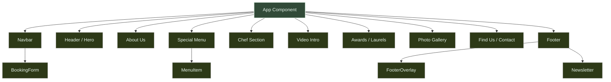
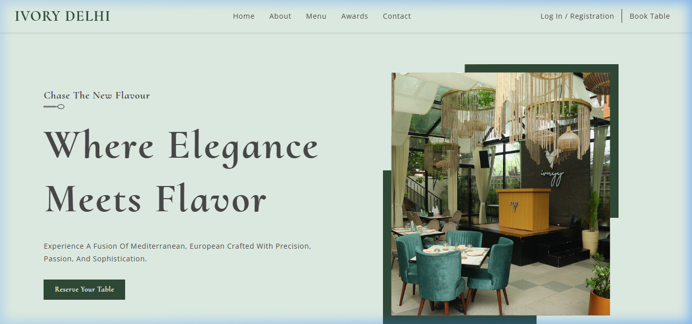

# 🍽️ Ivory Delhi Restaurant - Premium Landing Page

[](LICENSE)
[](https://github.com/Lalitmukesh69/ivoryy-delhi-restaurant-landing-page/stargazers)
[](https://reactjs.org/)
[](https://nodejs.org/)

> A modern, elegant, and state-of-the-art landing page for a luxury fine-dining restaurant in Delhi, crafted with React, custom styling, and smooth animations.

---

## 📊 Component Architecture Graph

Below is the layout graph of the React components showing the architecture and hierarchy of the Ivory Delhi page:



---

## 🌟 Visual Showcase

Here is a preview of the premium hero section of the Ivory Delhi landing page:



---

## ✨ Key Features

- **Luxury Design System:** Custom tailored typography using Cormorant Upright & Open Sans, smooth HSL-based forest green and gold theme.
- **Interactive Reservation:** Responsive design focusing on booking tables and exploring menus.
- **Modern UI/UX Patterns:** Developed using components following the BEM (Block, Element, Modifier) CSS architecture.
- **Fully Responsive:** Beautifully crafted layouts that scale seamlessly from 4K monitors down to mobile screens.
- **Performance & SEO:** Fast page loads, semantic HTML5 structure, and search engine optimized.

---

## 🛠️ Technology Stack

- **Framework:** React.js
- **Styling:** Vanilla CSS (BEM Architecture)
- **Icons:** React Icons (`react-icons`)
- **Server Options:** Cross-platform startup settings utilizing `cross-env` with OpenSSL support.

---

## 🚀 Getting Started

Follow these steps to run the application locally on your machine:

### 1. Prerequisites
Ensure you have [Node.js](https://nodejs.org/) installed (recommended version 18 or higher).

### 2. Installation
Clone the repository and install the dependencies:
```bash
npm install
```

### 3. Run the Development Server
Start the local server:
```bash
npm start
```
Open [http://localhost:3007](http://localhost:3007) in your browser to view the application.

### 4. Build for Production
To create an optimized production build:
```bash
npm run build
```

---

## 📄 License
Open source and available under the [MIT License](LICENSE).
